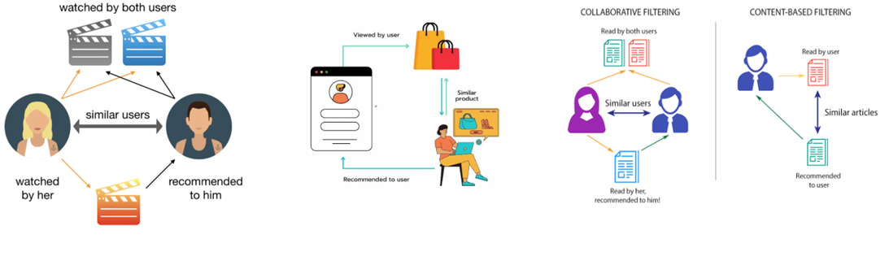

# AI, Machine Learning, NLP Portfolio

## Sentiment-Based Product Recommendation System for Ecommerce
To enhance user experience and drive sales, leading ecommerce companies use Machine Learning and NLP based techniques to recommend products based on customer preferences and choices. Through this project I have built a sentiment-based product recommendation system for an ecommerce company.  This system utilizes user reviews and ratings to recommend products more effectively by leveraging machine learning models for sentiment analysis and recommendation algorithms.

## Telecom Churn Prediction
Telecom companies face constant pressure to evolve due to shifting customer needs and market competition. Retaining customers and preventing churn is critical. Customers typically move through phases: initial satisfaction, a decline in experience due to factors like service issues or charges, and finally, churn, where they switch to another provider. Predicting churn probability early and taking proactive measures can help operators retain customers.

This project analyzes mobile usage and recharge data to identify features that impact churn. Using machine learning, we aim to develop models that predict churn probability, enabling timely action to reduce customer attrition.

## Telco Genie
Telecom companies face significant customer service challenges such as High Call Volume, Repetitive Queries, Long Wait Times and Agent Burnout. These challenges can be tackled to centain extent with conversational bots and AI agents for customer service that provide instant smart responses with a 24/7 availability, providing scalability and consistency. These agents can perform intelligent query resolution with the right tools being triggered for response augmentation based on the cutomer query and conversation context. The agents can thus help to have a Reduced Call Volume, Lower Agent Load, Faster Resolution and Operational Efficiency.

In this current version the TelcoGenie bot is a flask based application that works on a telecom customers and plans data set and answers queries related to Prepaid Balance, Postpaid Billing, Plan Details and also provides Plan recommendations based on customer's profile and inputs. It uses OpenAI's function calling feature to invoke tools to respond to specific customer queries.

